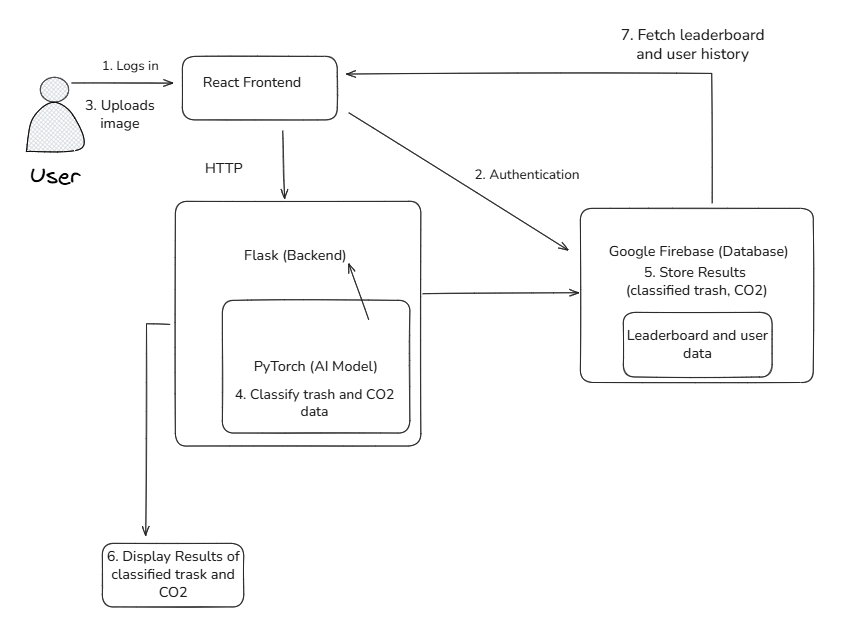

# SmartSort

## Problem
Recyclables, electronics, and food scraps are mixed with common trash, as a result, it is difficult to recycle and estimate carbon emissions.  
Proper waste sorting can significantly reduce environmental impact but many people don’t know how to sort their trash correctly.  

That’s why we created **SmartSort**, an AI-powered tool that helps individuals and companies to properly dispose of waste while tracking its carbon footprint.  

---

## SmartSort
**SmartSort** is a smart guide to sorting trash!  
With just the snap of a photo, users can:
- Instantly identify what type of waste it is (recyclable, compost, landfill, etc.)
- Learn where to properly dispose of it
- See the estimated **carbon emissions** of each item
- Compete on a **leaderboard** that gamifies sustainable habits

---

## ⚙️ Technical Challenges Faced
- Connecting the **Flask backend** with the **React frontend**
- Training and optimizing the **PyTorch model** to accurately classify trash images and calculate CO2 emissions

---

## 🧱 How We Built It
### 🖥️ Tech Stack
- **Frontend:** React + Tailwind CSS  
- **Backend:** Flask (Python)  
- **Database & Authentication:** Firebase  
- **AI Model:** PyTorch image classification model trained on 15k waste datasets  

### 🧩 Architecture Overview

1. The **user uploads a photo** from the frontend.  
2. The **Flask backend** receives it, processes it through the **PyTorch model**, and returns classification + emission data.  
3. **Firebase** stores user data. 
4. The **frontend** displays classification results and CO₂ estimates

### 🧠 Key Design Decisions
- Utilized the **MobileNetN2** deep learning model for computer vision tasks, particularly on mobile and embedded devices due to its speed
